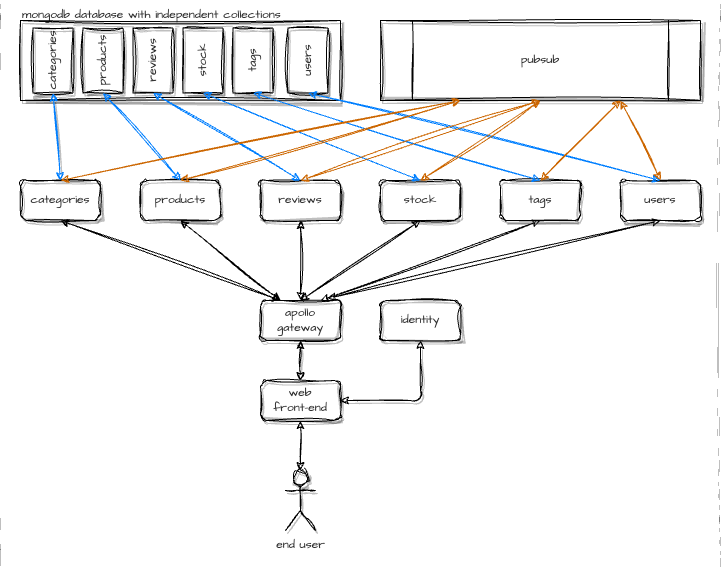

# Reviews POC
A yet another proof-of-concept project to learn [NodeJS](https://nodejs.org) and [Apollo Federation](https://apollographql.com). I do (did) [livestream](https://www.twitch.tv/lexdevel) of this project development, please feel free to subscribe :)

## Development environment requirements
1. [Docker](https://docker.com)
2. [NodeJS](https://nodejs.org)
3. Your favorite IDE

## Running
Clone this repo, navigate to the sources, run `docker compose up` command. Open a browser and navigate to `http://localhost:4000`.

## Architecture
Disclaimer: *For the demo purposes, a single database is been used. However, collections are independent (feel free to treat them as independent databases) and the idea works. This was done only for simplification*.


## Example queries

#### From the product's perspective
```graphql
query {
  products {
    id
    title
    price
    countInStock
    category {
      id
      name
    }
    tags {
      id
      name
    }
    reviews {
      commentary
      author {
        id
        username
        fullname
      }
    }
  }
}
```

#### From the review's perspective
```graphql
query {
  reviews {
    commentary
    author {
      id
      username
      fullname
    }
    product {
      id
      title
      price
      countInStock
      category {
        id
        name
      }
      tags {
        id
        name
      }
    }
  }
}
```

#### From the user's perspective
```graphql
query {
  users {
    id
    username
    fullname
    reviews {
      commentary
      product {
        id
        title
        price
        countInStock
        category {
          id
          name
        }
        tags {
          id
          name
        }
      }
    }
  }
}
```
